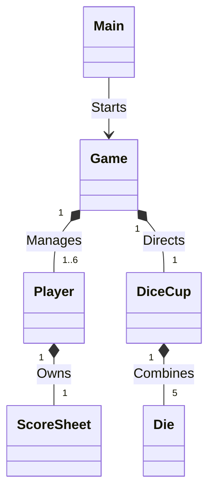

# Yahtzee
A fully functional, multiplayer console-based implementation of the classic dice game **Yahtzee**. This project is built entirely in Java using clean Object-Oriented Programming (OOP) design principles.

## 🚀 Features

- **Multiplayer Support**: Play with 1 to 6 players locally in the terminal.
- **Dynamic Turn Logic**: Standard Yahtzee rules allowing up to 3 rolls per turn with the ability to hold/unhold specific dice.
- **Robust Scoring Validation**: Automatically validates all 13 scoring categories (from Ones up to Large Straights and Yahtzee) and prevents players from overwriting previously used slots.
- **Input Error Handling**: Safely handles invalid user choices, string inputs where numbers are expected, and out-of-bounds selections.

---

## 🛠️ Project Architecture & OOP Structure

The game logic is separated into decoupled, dedicated classes to handle distinct responsibilities:

* **`Main.java`**: The application entry point. It sets up the player configurations, initializes the application, and handles resource cleanup.
* **`Game.java`**: Acts as the central controller. It manages game rounds, handles turn sequences, coordinates dice rolling, and manages input flows.
* **`Player.java`**: Represents an individual player, containing their name and maintaining their unique scorecard.
* **`DiceCup.java`**: Manages the array of 5 `Die` objects. Handles conditional rolling depending on which dice the player decides to "hold".
* **`Die.java`**: A standard 6-sided die component equipped with an independent random number generator.
* **`ScoreSheet.java`**: The core logic center for calculating scores. Tracks filled categories, totals points, and uses data-stream filtering to compute complex combinations like straights.

### Class Dependencies


## Prerequisites
Java Development Kit (JDK) 21 or higher.
Terminal / Command Prompt access, or an IDE like Eclipse / IntelliJ IDEA.

## How to run via Terminal
1. Clone the repository
   git clone [https://github.com/YOUR-USERNAME/YOUR-REPOSITORY-NAME.git](https://github.com/YOUR-USERNAME/YOUR-REPOSITORY-NAME.git)
cd YOUR-REPOSITORY-NAME
2. Compile the Source Files: create a target directory for compiled classes and run the Java Compiler:
   mkdir -p bin
   javac -d bin src/yahtzee/*.java
3. Launch the game
   java -cp bin yahtzee.Main

## How to Play
1. Setup: Enter the number of players (1 to 6) when prompted.
2. Rolling: On your turn, the game rolls all 5 dice automatically.
3. Holding Dice: Input the die number (1–5) to lock it in place. An asterisk * indicates a held die. Input the number again to release it.
4. Re-rolling: Type -1 when you are satisfied with your holds to roll the remaining unheld dice. You get up to 3 total rolls per turn.
5. Scoring: After your 3rd roll (or if you stop early), review your options and select a category number (1–13) to log your points.

## Project Structure
```text
Yahtzee/
├── .gitignore
├── README.md
├── module-info.java
└── src/
    └── yahtzee/
        ├── DiceCup.java
        ├── Die.java
        ├── Game.java
        ├── Main.java
        ├── Player.java
        └── ScoreSheet.java
    
